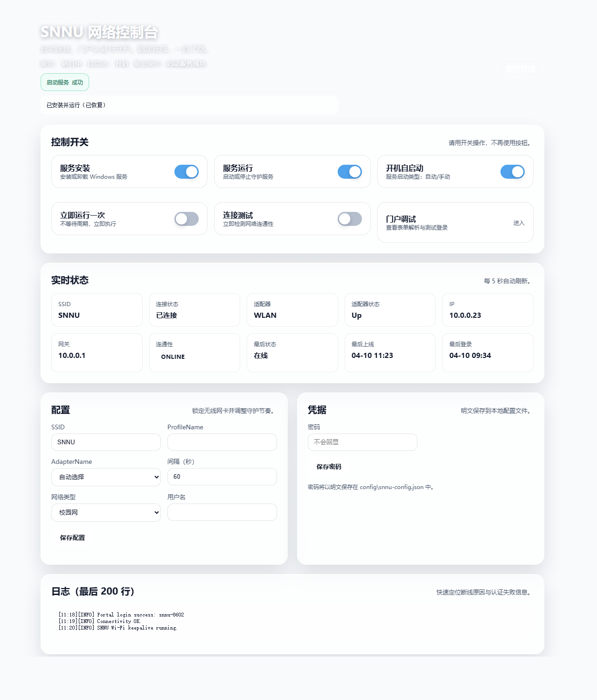
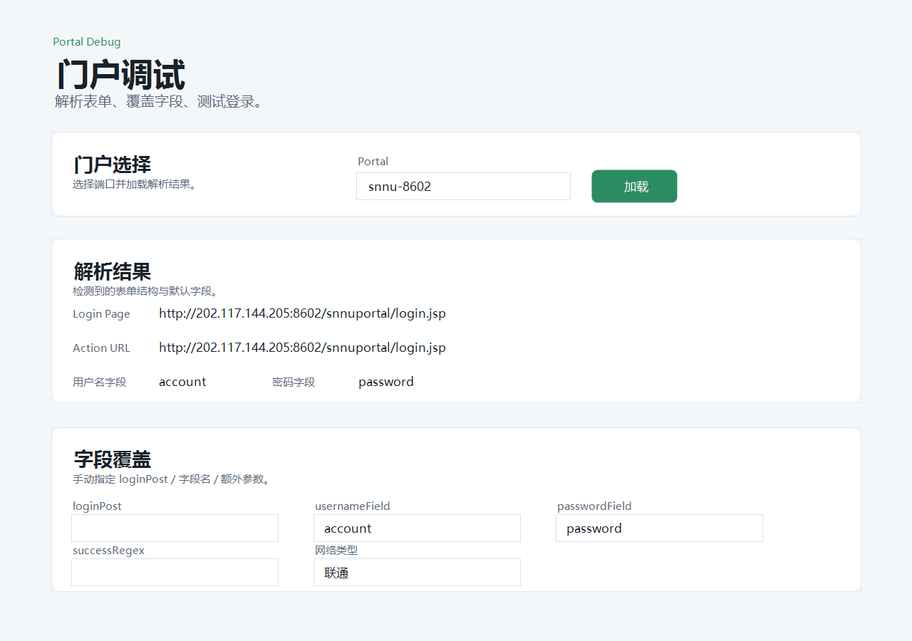

# SNNU Wi-Fi Console

陕西师范大学（SNNU）校园网专用的 Windows 本地控制台。它用于连接 `SNNU` Wi-Fi、完成学校 Portal 认证、管理后台守护服务，并在浏览器里查看实时状态和日志。

推荐 GitHub 仓库名：`snnu-wifi-console`

架构：Python 保活核心 + PowerShell 安装脚本 + Flask 控制台。

## 适用范围

本项目只面向陕西师范大学校园网环境：

- Wi-Fi SSID 默认为 `SNNU`
- Portal 地址默认为 `202.117.144.205:8602` 和 `202.117.144.205:8603`
- 登录线路支持：校园网、联通、移动
- 系统环境面向 Windows 11

其他学校或其他 Portal 系统大概率不能直接使用，需要自行修改 `config\snnu-config.json` 里的 Portal 地址、字段名和线路参数。

## Screenshots





## Features

- 自动连接 `SNNU` Wi-Fi。
- 自动检测网络连通性，并在离线时触发 Portal 登录。
- 可在系统配置里选择校园网、联通或移动线路。
- 支持 Windows Service 后台守护运行。
- 提供本地 Flask Web 控制台管理服务安装、运行、自启动、配置和日志。
- 提供 Portal Debug 页面，用于解析登录表单、覆盖字段并测试登录。

## Quick Start

1. 安装 Python 依赖：

```powershell
pip install -r .\requirements.txt
```

2. 创建本地配置文件：

```powershell
Copy-Item .\config\snnu-config.example.json .\config\snnu-config.json
```

3. 确保已经手动连接过一次 `SNNU` Wi-Fi，让 Windows 保存无线配置。

4. 写入账号密码：

```powershell
powershell -NoProfile -ExecutionPolicy Bypass -File .\scripts\set-credentials.ps1
```

5. 单次测试：

```powershell
powershell -NoProfile -ExecutionPolicy Bypass -File .\scripts\wifi-keepalive.ps1 -Once
```

6. 启动 Web 控制台：

```powershell
powershell -NoProfile -ExecutionPolicy Bypass -File .\scripts\start-web.ps1
```

然后打开：

```text
http://127.0.0.1:8608
```

也可以双击 `run.bat` 静默启动 Web 控制台。

## 线路选择

在 Web 控制台的“配置”区域选择网络类型：

- `校园网`
- `联通`
- `移动`

该选项会写入 `config\snnu-config.json` 的 `portalOptions.networkType`，后台服务和 Portal Debug 会读取同一份配置。

## Windows Service

管理员权限运行一次：

```text
install-helper.bat
```

安装 helper 后，可以直接在 Web 控制台里安装、启动、停止守护服务，以及设置开机自启动。

如果服务环境下 Portal 登录失败，在 `config\snnu-config.json` 里把 `pythonPath` 设置为完整的 `python.exe` 路径。

如需把 Wi-Fi profile 转为所有用户可用：

```powershell
powershell -NoProfile -ExecutionPolicy Bypass -File .\scripts\fix-wifi-profile.ps1 -Profile SNNU
```

## Project Structure

```text
config/
  snnu-config.example.json   # 可公开提交的配置模板
scripts/
  wifi-keepalive.ps1         # 兼容入口，转调 Python 保活核心
  set-credentials.ps1        # 写入本地账号密码
  install-service.ps1        # 安装 Windows 服务
  admin_helper.py            # 管理员 helper 服务
web/
  app.py                     # Flask 后端
  keepalive.py               # Python Wi-Fi 保活核心
  portal.py                  # Portal 表单解析和登录逻辑
  templates/                 # Web UI 页面
  static/                    # 样式、脚本和背景图
```

## Security Notes

- `config\snnu-config.json` 会保存本地账号密码，已通过 `.gitignore` 排除。
- `config\admin-token.txt` 和 `logs/` 也已排除，公开仓库时不要手动上传。
- 首次公开到 GitHub 前，建议运行 `git status --ignored` 确认敏感文件没有进入暂存区。

## License

未指定许可证前，默认保留所有权利。公开发布前建议补充 `LICENSE`。
